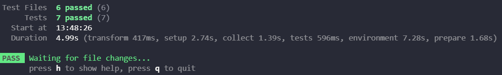
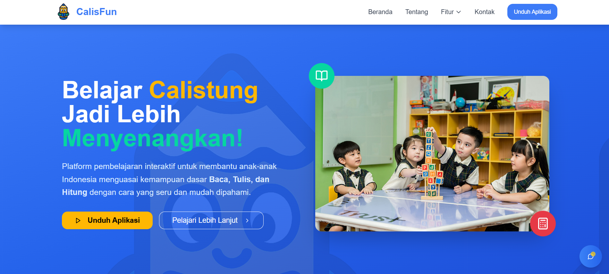
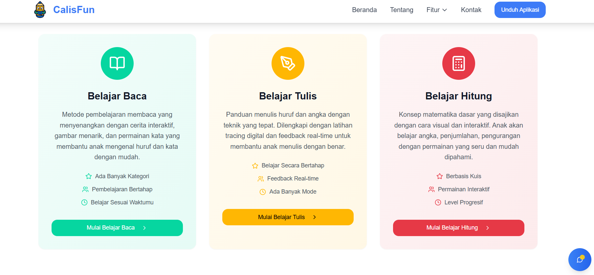
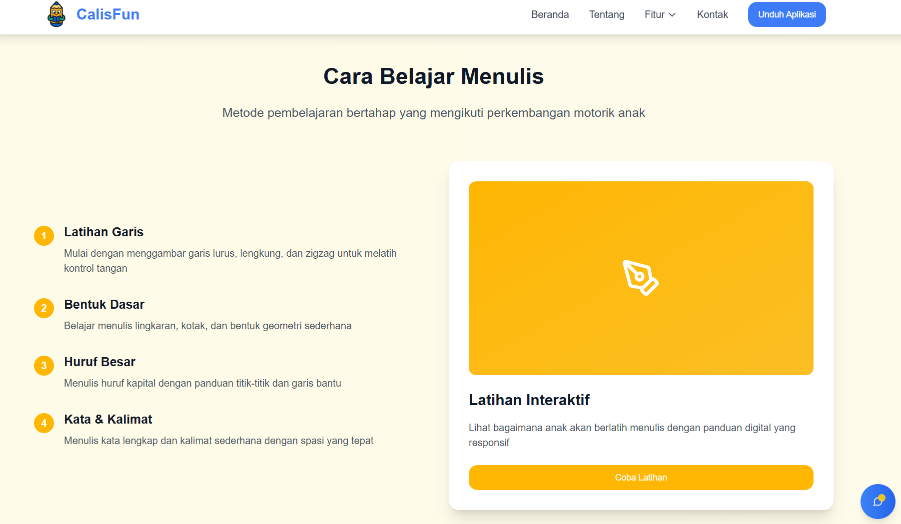
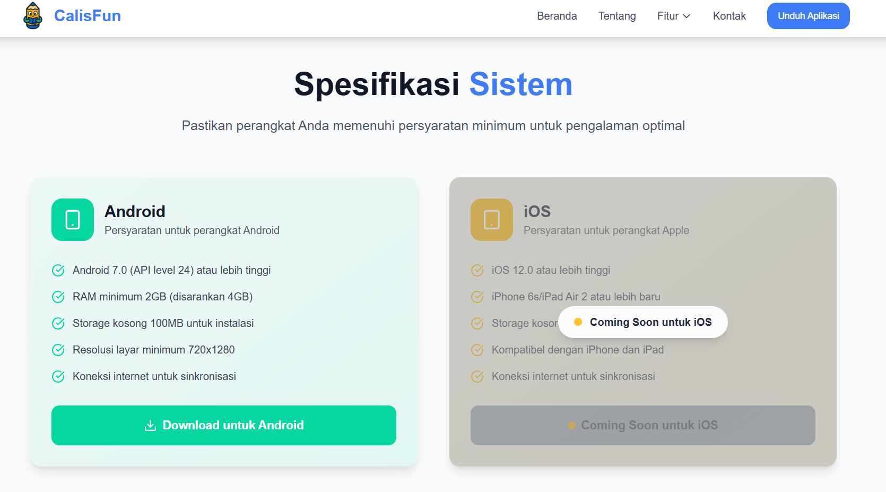
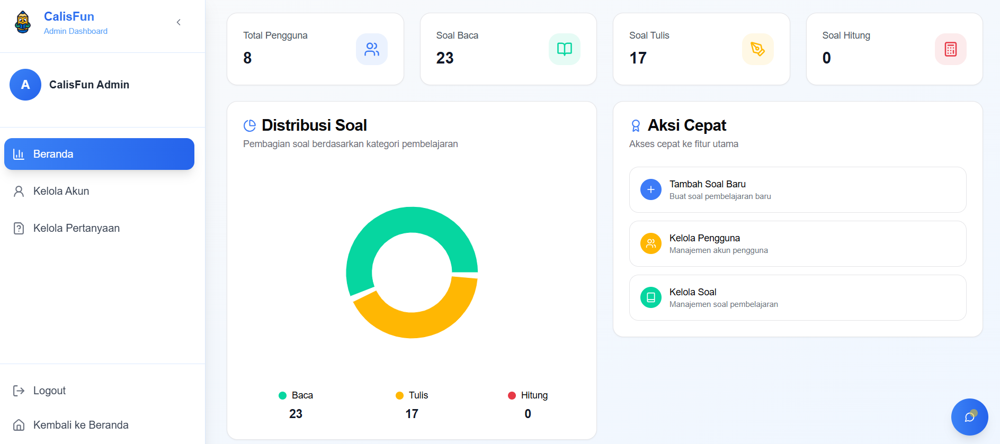
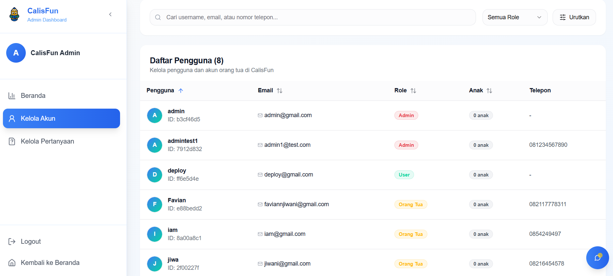
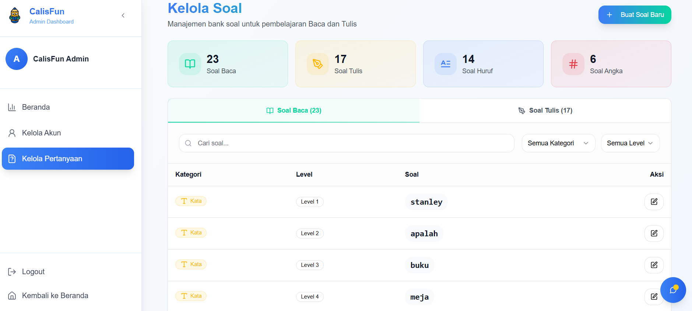

# CalisFun Web Repository Documentation

---

## 📃 Table of Contents
- [⚙️ Technology Stack](#-technology-stack)
- [🧩 Core Features](#-core-features)
- [🚀 Live Demo](#-live-demo)
- [🏗️ Architecture Pattern](#-architecture-pattern)
- [📈 Design Pattern](#-design-pattern)
- [🧑‍💻 Clean Code](#-clean-code)
- [🔒 Security](#-test-coverage)
- [📝 CI/CD](#-ci/cd)
- [🧪 Test Coverage](#-test-coverage)
- [⚡ Non-Functional Requirements](#-non-functional-requirements)
- [🚫 Out-of-Scope](#-out-of-scope)
- [🤵 Admin Account Information](#-admin-account)
- [🔐 .env Configuration](#-env-configuration)
- [🧰 Getting Started Locally](#-getting-started-locally)
- [🧭 Website Preview](#-website-preview)
- [👥 Owner](#-owner)
- [📬 Contact](#-contact)

---

## ⚙️ Technology Stack

<div align="center">

<kbd></kbd>
<kbd></kbd>
<kbd></kbd>
<kbd></kbd>
<kbd></kbd>
<kbd></kbd>

</div>

<div align="center">
<h4>React | TypeScript | Vite | TailwindCSS | ShadcnUI | Vitest</h4>
</div>

---

## 🧩 Core Features

### 🌐 Landing Page & SEO
- Provides an official information page about the CalisFun app.
- Serves as a promotional hub to increase app visibility through SEO optimization.
- Users can read the description, key features, testimonials, and view a preview of the app.

### 📥 APK Download
- Users can directly download the CalisFun app .apk file through the website.
- Alternative distribution option besides the Google Play Store/App Store.
- The download link for the latest version is always available and integrated with release management.

### 🛠️ Admin Dashboard
- **User Account Management:** Create, edit, deactivate, or delete child and parent accounts.
- **Question & Content Management:** CRUD practice questions (handwriting, spelling, counting) for the CalisFun app.
- **Data Analytics:** Displays learning progress data, number of users, daily activity, and app performance statistics.
- **Role Management:** differentiates admin and moderator access for more controlled security & management.

---

## 🚀 Live Demo

👉 [https://calis-fun.vercel.app](https://calis-fun.vercel.app/)

---

## 🏗️ Architecture Pattern

### Repository Structure

```
calis-fun-web/
├── .github/                    # GitHub workflows / CI configuration
├── coverage/                   # Coverage reports (Using Vitest)
├── Images/                     # Repo-related images (for docs/README)
├── node_modules/               # Dependencies (auto-generated)
├── public/                     # Static public assets (favicon, static images, manifest, etc.)
│
├── src/                        # Main source code
│   ├── assets/                 # Images, icons, and static files for UI
│   ├── components/             # Reusable React components (UI building blocks)
│   ├── context/                # React context providers (Auth, Theme, Global State)
│   ├── hooks/                  # Custom React hooks
│   ├── layouts/                # Layout components (e.g., Admin layout, Landing layout)
│   ├── lib/                    # Utility libraries (API clients, helpers)
│   ├── pages/                  # Page-level components (Landing page, Dashboard, etc.)
│   ├── services/               # API calls & backend integration (Express/MongoDB endpoints)
│   ├── tests/                  # Unit & integration tests
│   ├── types/                  # TypeScript types and interfaces
│   ├── utility/                # Utility functions (formatting, constants, validation)
│   │
│   ├── App.tsx                 # Main app component (routing entry point)
│   ├── index.css               # Global CSS styling
│   ├── main.tsx                # Entry point for React + Vite
│   └── vite-env.d.ts           # TypeScript env type definitions
│
├── .env                        # Environment variables (local)
├── .env.sample                 # Sample env file for reference
├── .gitignore                  # Git ignore rules
├── components.json             # Config file for shadcn/ui or custom component setup
├── eslint.config.js            # ESLint rules & configs
├── index.html                  # Root HTML file (for Vite/React)
├── package.json                # Project metadata & dependencies
├── package-lock.json           # Locked dependency 
├── README.md                   # Repository Documentation
├── tailwind.config.js          # Tailwind Configuration
├── vercel.json                 # Vercel Config for Deployment
├── vite.config.ts              # Vite Configuration
```


### **Architecture Principles**

The architecture for the **CalisFun Web Frontend** follows a **Layered Architecture** with emphasis on **scalability, reusability, and maintainability**.

1. **Layered Architecture Pattern**

    * Presentation Layer (UI): components, layouts, and pages folder
    * Application Layer (State & Orchestration Layer): context and hooks folder
    * Domain Layer (Business): services, utility, and lib folder
    * Infrastructure Layer: types, tests, public, assets folder

2. **Component-First**

   * `components/` holds reusable UI building blocks (buttons, cards, forms).
   * `layouts/` defines page skeletons (Landing, Dashboard).
   * `pages/` contain high-level views that orchestrate components.

3. **Separation of Concerns**

   * `services/` → communication layer for backend API.
   * `context/` → global state & role-based access (parent, child, admin).
   * `hooks/` → encapsulate reusable logic for cleaner components.
   * `utility/` → shared utilities (formatting, constants, validation).

4. **Scalability in Mind**

   * `types/` → enforce strong typing with TypeScript.
   * `tests/` → ensure testability with Jest/Vitest.
   * `assets/` → central location for images/icons for consistency.

5. **Vite + React + TS Setup**

   * `main.tsx` → bootstraps React.
   * `App.tsx` → app-wide routing & layout injection.
   * Integrated with **shadcn/ui** + **TailwindCSS** for clean and modern UI.


---


## 🎨 Design Pattern

The CalisFun Web Frontend applies common **software design patterns** (Creational, Structural, and Behavioral) to ensure scalability and maintainability:

### 🔨 Creational Patterns
- **Singleton Pattern**  
  - Applied in global contexts (e.g., `AuthContext`) to ensure only **one instance** of state is shared across the app.  
  - Guarantees consistent authentication state 

- **Factory Pattern**  
  - Used in UI component generation (e.g., dynamic form fields, button variants via `shadcn/ui`).  
  - Enables creating multiple styled components from a single factory function.  

---

### 🏗️ Structural Patterns
- **Module Pattern**  
  - Each feature is modularized (`/services`, `/hooks`, `/pages`) for better separation of concerns.  
  - Improves scalability when new modules (e.g., new quiz type) are introduced.  

- **Facade Pattern**  
  - `services/` layer acts as a simplified interface for complex backend/AI API calls.  
  - Hides low-level HTTP details and provides clean functions like `loginUser()`, `fetchLeaderboard()`.  

---

### 🤝 Behavioral Patterns
- **Observer Pattern**  
  - React’s state and context system naturally implement the observer pattern: when state changes, subscribed components automatically update.

- **Command Pattern**  
  - User interactions (button clicks, form submissions) are encapsulated as discrete actions handled by event handlers.  
  - Decouples UI elements from the logic execution.  

- **Mediator Pattern**  
  - The `context/` provider acts as mediator between unrelated components (e.g., AdminDashboard ↔ UserProfile), reducing direct dependencies.  

By combining these **Creational, Structural, and Behavioral** patterns, the frontend architecture remains **modular, testable, and extensible**, while ensuring smooth collaboration between UI components, business logic, and backend APIs.

---

## 🧼 Clean Code Principles

To ensure maintainability and readability, we enforce **Clean Code Principles**:

- **Naming Conventions**  
  - Variables, functions, and components use clear, descriptive names.  
  - Follows **camelCase** for variables/functions and **PascalCase** for React components.  

- **Small & Focused Components**  
  - Each component does **one thing well**.  
  - Large pages are broken down into smaller, reusable UI blocks.  

- **Consistent Styling**  
  - Unified design system via **TailwindCSS** + `shadcn/ui`.  
  - Global styles are minimized; utility classes ensure consistency.  

- **Linting & Formatting**  
  - Enforced with **ESLint** and **Prettier** to maintain consistent code style.  
  - CI/CD pipeline blocks PRs if linting/tests fail.  

- **Type Safety**  
  - Strongly typed with **TypeScript**.  
  - All shared contracts/interfaces live under `/src/types/`.  

- **Testing**  
  - Unit and integration tests in `/src/tests/`.  
  - Ensures critical features (auth, forms, dashboard) are always reliable.  

- **Separation of Concerns**  
  - Logic (hooks, services) is decoupled from UI (components).  
  - Pages orchestrate multiple components instead of holding business logic.  

---

## 🔒 Security

The CalisFun Web Frontend implements multiple security measures to ensure safe usage:

- **JWT Authentication**  
  - All API requests to backend services are authenticated using **JSON Web Tokens (JWT)**.  

- **Role-Based Access Control (RBAC)**  
  - Different roles (Guest User and Admin) have limited access.  
  - Admin Dashboard is protected by strict role verification and server-side validation.    

- **Secure Communication**  
  - All requests are sent over **HTTPS**.  
  - API keys and secrets are not hardcoded but injected via **environment variables**.  

- **Additional Frontend Security**  
  - ESLint + TypeScript to catch potential unsafe code.  
  - Regular dependency audit (`npm audit`) to identify vulnerabilities.  

---

## 📝 CI/CD

The CI/CD pipeline for CalisFun Web Frontend is designed to ensure **automation, reliability, and fast iteration**:

- **GitHub Actions (Workflows)**  
  - Runs automated tests (unit + integration) on every `pull request` and `main` branch push.  
  - Performs **linting & build check** to ensure code quality.  
  - Generates coverage reports under `/coverage`.  

- **Vercel Deployment**  
  - Integrated with **Vercel** for seamless frontend hosting.  
  - Every push to `main` branch triggers an automatic deployment to production.  
  - Preview deployments are generated for every pull request → allows QA & stakeholder review before merging.  

**CI/CD Flow:**  
1. Developer pushes code → GitHub Actions runs tests & checks.  
2. Vercel automatically builds & deploys latest version.  
3. Production site is updated instantly with zero-downtime deployment.  


---

## 🧪 Test Coverage


The CalisFun Web Frontend applies a **multi-layered testing strategy** to ensure reliability and maintainability.

### 🔍 Testing Scope
- **Unit Tests**  
  - For reusable components (buttons, forms, inputs).  
  - For hooks and utility functions.  

- **Integration Tests**  
  - Validating data flow between components and services.  
  - Example: Login → AuthContext → API service → UI update.  

- **End-to-End (E2E) Tests**
  - Simulating real user flows such as:
    - Admin Login -> Manage User -> Manage Question -> CRU Question

---

### 🧪 Testing Tools
- **Vitest** → Unit & integration tests.  
- **React Testing Library** → Component rendering and user interaction tests.  

---

### 📊 Coverage Metrics
The test coverage reports are generated automatically under the `/coverage` folder.  
Metrics tracked:
- **Statements** → Percentage of code statements executed.  
- **Branches** → Conditional branches covered.  
- **Functions** → Functions invoked during tests.  
- **Lines** → Executed lines vs total lines.  

We already succedd to passed some of unit tests such as button test, shadcnui library test, navbar test, and etc. We also already manually tested our website and from user perspective we can know better about CalisFun and download the app. From the admin perspective we can manage users and questions for CalisFun.



---

## ⚡ Non-Functional Requirements (NFR)

To ensure the **CalisFun Frontend Website** meets enterprise-level standards, we define the following **Non-Functional Requirements**:

### 🔹 Performance
- Page load time: **< 2 seconds** for landing pages.  
- API response time: **< 500 ms** average per transaction.

### 🔹 Availability
- Target uptime: **99.9% SLA** with Vercel hosting.  
- Automatic redeploy on every push to `main` branch ensures minimal downtime.  

### 🔹 Scalability
- Designed to handle **10× user growth** (e.g., 10k → 100k active users). 
- Modular frontend components ensure smooth addition of new features.  

### 🔹 Security
- **JWT-based Authentication** integrated with backend.  
- **Role-Based Access Control (RBAC)** to differentiate Admin vs User features.  
- Secure HTTPS communication with environment-based API keys.  

### 🔹 Maintainability
- **Layered and modular architecture** (components, services, hooks).  
- Centralized **error handling & logging** for debugging.  
- Enforced coding standards with **ESLint + Prettier**.  
- Continuous test coverage (unit + integration tests with Vitest).  

---

## 🚫 Out-of-Scope

The following items are **explicitly excluded** from this iteration of CalisFun Frontend Website:

- ❌ **Mobile App Functionality**  
  - The mobile learning experience is only available through the **Flutter-based mobile app**, not on the web.  

- ❌ **Automated AI Content Management**  
  - All questions, exercises, and learning content are manually curated via the **Admin Dashboard**.  
  - No AI auto-generation of new questions in this release.  

- ❌ **Offline-First Web Experience**  
  - Website requires an internet connection for authentication, data fetching, and dashboard usage.  


## 🤵 Admin Account

For testing, you can access the admin account credential

Open this Link: <a href="https://calis-fun.vercel.app/admin-login">Admin Login Page</a>

Email: admin@gmail.com
Password: admin

---

## 🔐 .env Configuration

.env to connect with the backend successfully
```
VITE_API_BASE_URL=http://localhost:3000/api
```

You can also copy the .env.sample then rename it to .env

---

## 🧰 Getting Started Locally

### Prerequisites
- **Node.js** (v16+)
- **Git**

### Clone the Project
```bash
git clone https://github.com/best-team-compfest17/CalisFun-Web.git
cd CalisFun-Web
npm install
npm run dev # Run the local server
npm run test # Run vitest test
npm run test --coverage # Make the test coverage report
```

---

## 📸 &nbsp;Website Preview
<table style="width:100%; text-align:center">
    <col width="100%">
    <tr>
        <td width="1%" align="center"></td>
    </tr>
    <tr>
        <td width="1%" align="center">Home Page</td>
    </tr>
    <tr>
        <td width="1%" align="center"></td>
    </tr>
    <tr>
        <td width="1%" align="center">Features Page</td>
    </tr>
    <tr>
        <td width="1%" align="center"></td>
    </tr>
    <tr>
        <td width="1%" align="center">Sample Feature Page</td>
    </tr>
    <tr>
        <td width="1%" align="center"></td>
    </tr>
    <tr>
        <td width="1%" align="center">Download Page</td>
    </tr>
    <tr>
        <td width="1%" align="center"></td>
    </tr>
    <tr>
        <td width="1%" align="center">Admin Overview Dashboard Page</td>
    </tr>
    <tr>
        <td width="1%" align="center"></td>
    </tr>
    <tr>
        <td width="1%" align="center">Admin Manage User Dashboard Page</td>
    </tr>
    <tr>
        <td width="1%" align="center"></td>
    </tr>
    <tr>
        <td width="1%" align="center">Admin Manage Question Page</td>
    </tr>
</table>

---

## 👥 Owner

This Repository is created by Team 1
<ul>
<li>Stanley Nathanael Wijaya - Fullstack Developer</li>
<li>Haikal Iman F - Mobile Developer</li>
<li>Muhammad Favian Jiwani - Mobile Developer</li>
<li>Raditya Ramadhan - Backend Developer</li>
<li>Muhammad Ridho Ananda - Mentor</li>
</ul>
As Final Project for SEA Academy Compfest 17

---

## 📬 Contact
Have questions or want to collaborate?

- 📧 Email: stanley.n.wijaya7@gmail.com
- 💬 Discord: `stynw7`

<code>Made with ❤️ by The Calon Best Team</code> 